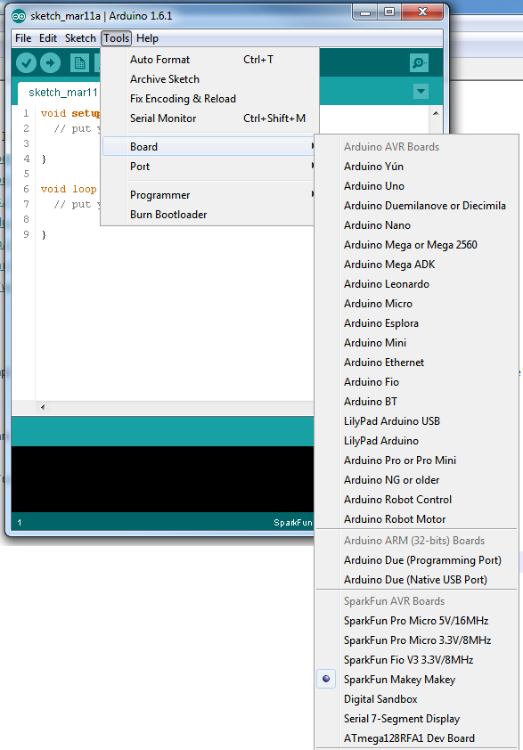

# SparkFun Arduino Boards

This repository contains support for the following TimmehTimmeh Arduino-compatible development boards:

#### AVR Boards

* [Tim's Reflow Board]

Each board will be added as an entry to the Arduino **Tools** > **Board** menu.

### Installation Instructions

To add board support for our products, go to **File** > **Preferences**, and paste this URL into the 'Additional Boards Manager URLs' input field:

	https://raw.githubusercontent.com/timmehtimmeh/ReflowController/master/IDE_Board_Manager/package_sparkfun_index.json

This field can be found in 'Preferences...' under the Arduino File menu.

Now, under the **Tools** > **Board** > **Boards Manager...**, if you type in "TimmehTimmeh", you will see an option to install board files for the reflow controller board. Click "Install" to add these to your list.

**NOTE: If you are using Arduino 1.6.6 and the link isn't working for you, change "https" at the beginning of the link to "http" and try again. We're working to figure out why this is happening in version 1.6.6.**

Now, when you select the Boards list, you will see a collection of new boards for Timmeh.

### Cleaning up the Boards Menu

Each entry in the boards list is defined in [boards.txt](https://github.com/timmehtimmeh/ReflowController/master/ReflowBoard/timmehtimmeh/avr/boards.txt).

### Notes

* **Please note: This will only work under Arduino IDE versions 1.5 and up.**
* Information on compiling and programming the bootloaders can be found in the bootloaders directory.
